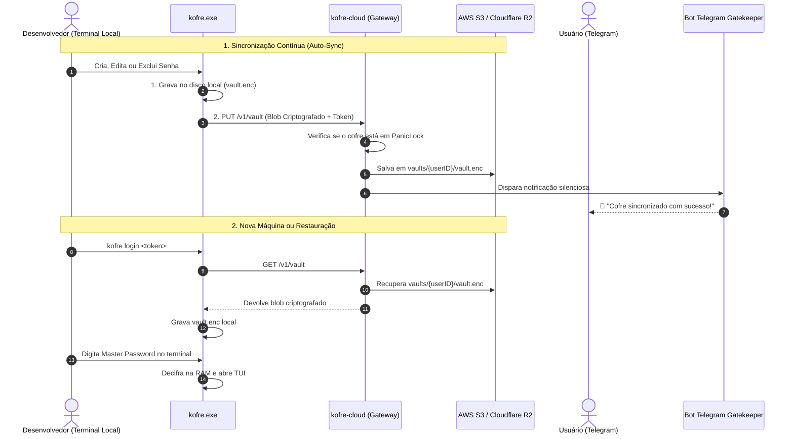

# 🔐 Kofre — Arquitetura de Segurança e Zero-Knowledge

Este documento descreve detalhadamente a arquitetura criptográfica, o fluxo de dados, a integração com a nuvem (S3 / Railway) e o funcionamento do Bot oficial do Telegram.

---

## 1. Princípio Fundamental: Zero-Knowledge (E2EE)

No Kofre, o servidor **NUNCA decifra nada e JAMAIS tem acesso a qualquer senha ou credencial**.

- **Sua Master Password nunca sai da sua máquina.** Ela nunca é enviada pela rede, nunca é gravada em logs e nunca chega ao Railway ou à AWS.
- **O servidor é apenas um intermediário cego de armazenamento (Storage Broker).** Ele apenas transporta blocos binários opacos e indecifráveis (`vault.enc`).
- Mesmo que o servidor Railway seja invadido ou o bucket AWS S3 seja exposto publicamente, **nenhum dado é vazado**, pois tudo está blindado com criptografia militar de ponta a ponta.

---

## 2. Onde as Senhas São Decifradas?

A decifração acontece **exclusivamente na memória RAM do seu computador local (`kofre.exe`)**:

```
[ Usuário digita Master Password no Terminal ]
                     │
                     ▼ (Processamento 100% Local)
       ┌───────────────────────────────┐
       │      kofre.exe (Local RAM)    │
       │                               │
       │  1. Argon2id (64MB / 3 iters) │
       │     Gera chave AES de 256-bit │
       │  2. AES-256-GCM               │
       │     Decifra o payload         │
       │  3. Injeta no processo filho  │
       │     ou exibe na tela TUI      │
       │  4. ZeroBytes() na saída      │
       └───────────────────────────────┘
```

### O Fluxo quando o usuário busca/usa uma senha:
1. **Download do Blob:** O `kofre.exe` faz um `GET /v1/vault` para a API.
2. **Entrega Criptografada:** A API no Railway busca o arquivo no S3 e o devolve para o `kofre.exe` **ainda 100% criptografado** via canal seguro HTTPS (TLS).
3. **Desbloqueio Local:** O seu terminal pede a sua **Master Password**.
4. **Decifração em RAM:** O seu processador executa o Argon2id, deriva a chave e abre o cofre na memória RAM volátil.
5. **Limpeza da RAM:** Ao fechar a tela ou terminar o comando (`kofre exec`), o Kofre sobrescreve todos os bytes da chave e das senhas na RAM com zeros (`mycrypto.ZeroBytes`).

---

## 3. Estrutura Criptográfica do Arquivo (`vault.enc`)

O arquivo gravado no disco e no S3 possui a seguinte estrutura binária inviolável:

| Offset | Tamanho | Campo | Descrição |
|---|---|---|---|
| `0..31` | 32 bytes | **Salt Argon2id** | Salt criptográfico aleatório único por cofre gerado via `crypto/rand` |
| `32..43` | 12 bytes | **Nonce / IV** | Vetor de inicialização padrão do AES-256-GCM |
| `44..N-16` | Variável | **Ciphertext** | Payload JSON compactado com Gzip e criptografado com AES-256 |
| `N-16..N` | 16 bytes | **Auth Tag GCM** | Tag de integridade que impede qualquer adulteração ou corrupção de bits |

> **Nota:** Sem a Master Password para derivar a chave a partir do Salt, é matematicamente impossível reverter o Ciphertext.

---

## 4. Arquitetura de Sincronização e Nuvem



---

## 5. O Bot do Telegram (`@kofredev_bot`)

O bot oficial atua como uma camada de **governança, telemetria e botão de emergência**:

### Recursos do Bot:
- **`/panic` (Kill-Switch Remoto):** Bloqueia instantaneamente o cofre no servidor. Se ativado, qualquer tentativa de `GET` ou `PUT` na nuvem é sumariamente rejeitada pela API com `HTTP 423 Locked`.
- **`/unlock`:** Desativa a trava de pânico e devolve o acesso aos dispositivos legítimos.
- **`/status`:** Consulta o estado de segurança, data e hora da última sincronização e tamanho do cofre.
- **Alertas em Tempo Real:** Disparados a cada alteração ou download.

### Código-Fonte Relevante no Repositório:
- **Motor do Bot e Webhook:** [`pkg/server/telegram.go`](file:///D:/Projetos/myCofre/pkg/server/telegram.go)
- **Servidor e Rotas:** [`pkg/server/server.go`](file:///D:/Projetos/myCofre/pkg/server/server.go)
- **Auto-Sync Provider:** [`pkg/storage/sync.go`](file:///D:/Projetos/myCofre/pkg/storage/sync.go)
- **Auto-Updater e Releases:** [`pkg/updater/updater.go`](file:///D:/Projetos/myCofre/pkg/updater/updater.go)
- **Criptografia Core:** [`pkg/crypto/crypto.go`](file:///D:/Projetos/myCofre/pkg/crypto/crypto.go)
