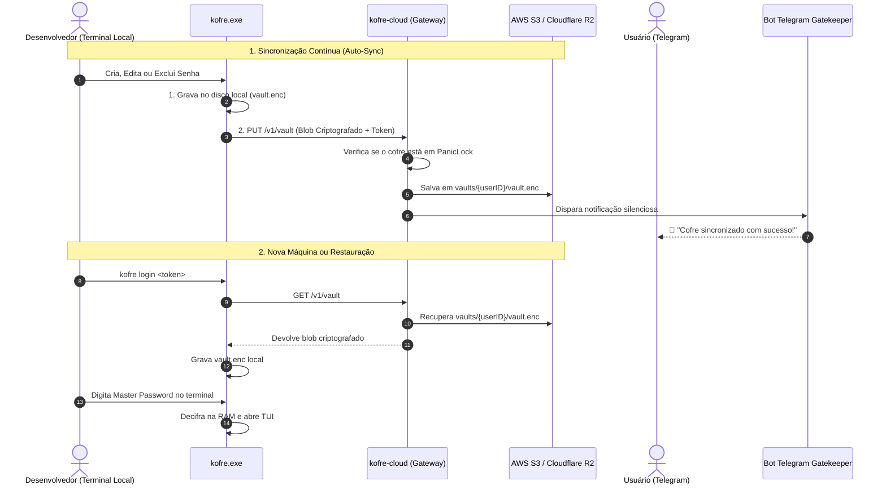

# 🔐 Kofre — Arquitetura de Segurança e Zero-Knowledge

Este documento descreve detalhadamente a arquitetura criptográfica, o fluxo de dados, a integração com a nuvem (S3 / Railway) e o funcionamento do Bot oficial do Telegram.

---

## 1. Princípio Fundamental: Zero-Knowledge (E2EE)

A decifração das credenciais acontece no cliente. O gateway armazena o cofre cifrado, licenças, vínculos e segredos remotos dos envelopes Telegram por dispositivo.

- **Sua Master Password nunca sai da sua máquina.** Ela nunca é enviada pela rede, nunca é gravada em logs e nunca chega ao Railway ou à AWS.
- O gateway transporta `vault.enc` cifrado e gerencia metadados de autorização. A metade remota do envelope Telegram, sozinha, não reconstrói a chave do cofre.
- Exposição do servidor ou bucket revela metadados e bytes cifrados. A segurança do conteúdo também depende da senha mestre, das chaves e da integridade do cliente; não há promessa de inviolabilidade.

---

## 2. Onde as Senhas São Decifradas?

A decifração acontece **exclusivamente na memória RAM do seu computador local (`kofre.exe`)**:

```
[ Usuário digita Master Password no Terminal ]
                     │
                     ▼ (Processamento 100% Local)
       ┌───────────────────────────────┐
       │      kofre.exe (Local RAM)    │
       │                               │
       │  1. Argon2id (64MB / 3 iters) │
       │     Gera chave AES de 256-bit │
       │  2. AES-256-GCM               │
       │     Decifra o payload         │
       │  3. Injeta no processo filho  │
       │     ou exibe na tela TUI      │
       │  4. ZeroBytes() na saída      │
       └───────────────────────────────┘
```

### O Fluxo quando o usuário busca/usa uma senha:
1. **Download do Blob:** O `kofre.exe` faz um `GET /v1/vault` para a API.
2. **Entrega Criptografada:** A API no Railway busca o arquivo no S3 e o devolve para o `kofre.exe` **ainda 100% criptografado** via canal seguro HTTPS (TLS).
3. **Desbloqueio Local:** O seu terminal pede a sua **Master Password**.
4. **Decifração em RAM:** O seu processador executa o Argon2id, deriva a chave e abre o cofre na memória RAM volátil.
5. **Limpeza da RAM:** Ao fechar a tela ou terminar o comando (`kofre exec`), o Kofre sobrescreve todos os bytes da chave e das senhas na RAM com zeros (`mycrypto.ZeroBytes`).

---

## 3. Estrutura Criptográfica do Arquivo (`vault.enc`)

O arquivo gravado no disco e no S3 possui a seguinte estrutura binária:

| Offset | Tamanho | Campo | Descrição |
|---|---|---|---|
| `0..7` | 8 bytes | **Magic** | `KOFRE001`, com leitura compatível de `MYCOFRE1` |
| `8..23` | 16 bytes | **Salt Argon2id** | Salt aleatório por cofre; renovado na troca da senha mestre |
| `24..35` | 12 bytes | **Nonce / IV** | Nonce aleatório por gravação AES-GCM |
| `36..N-17` | Variável | **Ciphertext** | Payload JSON cifrado; não usa Gzip |
| `N-16..N-1` | 16 bytes | **Auth Tag GCM** | Verificada durante a decifração |

A senha mestre forte e a proteção da chave continuam necessárias. Revelação, clipboard e processos filhos produzem cópias fora dos buffers controlados.


---

## 4. Arquitetura de Sincronização e Nuvem



---

## 5. O Bot do Telegram (`@kofredev_bot`)

O bot oficial atua como uma camada de **governança, telemetria e botão de emergência**:

### Recursos do Bot:
- **`/panic` (Kill-Switch Remoto):** Bloqueia instantaneamente o cofre no servidor. Se ativado, qualquer tentativa de `GET`, `PUT` ou `DELETE` na nuvem é sumariamente rejeitada pela API com `HTTP 423 Locked`.
- **`/unlock`:** Desativa a trava de pânico e devolve o acesso aos dispositivos legítimos.
- **`/status`:** Consulta o estado de segurança, data e hora da última sincronização e tamanho do cofre.
- **Alertas em Tempo Real:** Disparados a cada alteração ou download.

### Código-Fonte Relevante no Repositório:
- **Motor do Bot e Webhook:** [`pkg/server/telegram.go`](../../kofre-cloud/pkg/server/telegram.go)
- **Servidor e Rotas:** [`pkg/server/server.go`](../../kofre-cloud/pkg/server/server.go)
- **Auto-Sync Provider:** [`pkg/storage/sync.go`](../pkg/storage/sync.go)
- **Auto-Updater e Releases:** [`pkg/updater/updater.go`](../pkg/updater/updater.go)
- **Criptografia Core:** [`pkg/crypto/crypto.go`](../pkg/crypto/crypto.go)

## 6. Autorização, dispositivos e recuperação de sincronização

O webhook exige `X-Telegram-Bot-Api-Secret-Token` e conversa privada do titular. Status e verificação do desafio também exigem Bearer e conferem a conta. Expiração, limite de tentativas e entrega única são controlados sob trava. Licenças precisam de emissão administrativa, estado ativo e vencimento futuro; erro ou ausência de perfil não autoriza acesso.

Cada envelope tem um `device_id` e um segredo remoto próprio. Envelope novo não substitui segredos de outros computadores. Após troca de senha, outros dispositivos devem baixar o cofre atualizado e usar a nova senha mestre para recriar seus envelopes. Uma falha ao atualizar o Telegram é informada sem desfazer a troca de senha já persistida.

A sincronização preserva `vault.enc.sync-pending.json` até confirmar o envio. Falha remota mantém o estado local e pendente; reiniciar retoma o envio. Troca de destino com pendência é recusada. O encerramento informa se o prazo do `Flush` terminou antes da confirmação.

Os instaladores e o updater exigem checksum SHA-256 e tamanho; downloads usam uma versão específica. Gravações locais preparam e sincronizam um temporário antes de substituir o destino, sem apagar o arquivo anterior em caso de falha.

Veja [contratos de migração e validação](../../kofre-cloud/docs/AJUSTES_SEGURANCA.md). Builds Windows, Linux e macOS foram reconferidos; execução de APIs Windows e smoke são validados no Windows.
